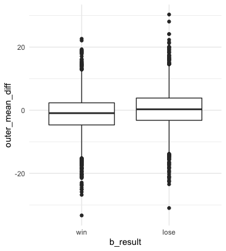
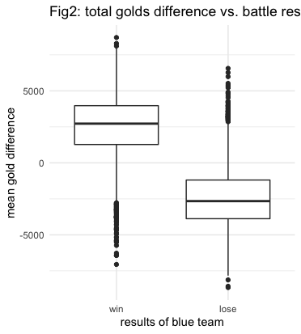
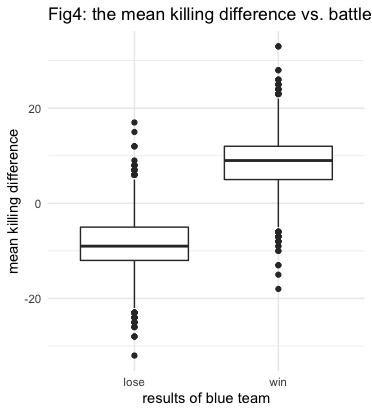
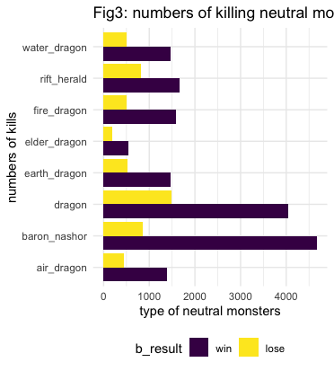

bTower means the mean time blue team destroy enemy's outer towers among three lanes, rTower means the mean time red team destroy enemy's outer towers among three lanes. We care about the impact of different of mean time between two groups. from the plot, we can see that if bTower is smaller than rTower (meaning that blue teams destroy red teams' outer tower faster) there will be a higher win rate among blue teams

The figure above shows the average gold difference across the whole game when blue team wins and blue team loses. The gold difference is calculated by the total gold of blue team minus that of red team in every minutes of the game. As we expected, the average mean of gold difference should be higher when blue team wins the game.

